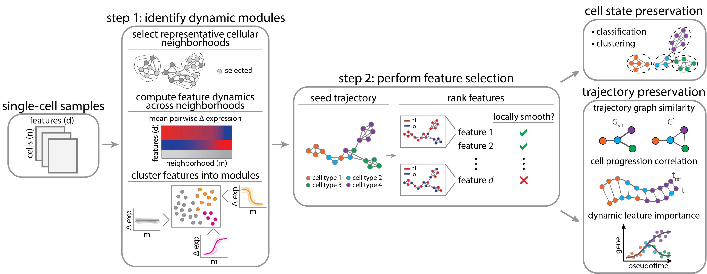

# DELVE
Dynamic selection of locally covarying features

## Introduction

DELVE is an unsupervised feature selection method for identifying a representative subset of dynamically-expresed molecular features that recapitulate cellular trajectories. In contrast to previous work, DELVE uses a bottom-up approach to mitigate the effect of unwanted sources of feature variation confounding inference, and instead models cell states from dynamic feature modules that constitute core regulatory complexes. For more details on the method, please read the associated preprint: [Ranek JS, Stallaert W, Milner J, Stanley N, and Purvis JE. Feature selection for preserving biological trajectories in single-cell data. _bioRxiv_. 2023]().

<p>
  
</p>

For a comparison of alternative feature selection methods and the overall benchmarking pipeline, please see [delve_benchmark](https://github.com/jranek/delve_benchmark). 

## Installation
Dependencies 
* Python >= 3.6, anndata 0.7.6, numpy 1.19.5, scipy 1.7.1, tqdm 4.63.0, umap-learn 0.5.1, pandas 1.1.5, scikit-learn 0.23.2 

You can clone the git repository by, 
```
git clone https://github.com/jranek/delve.git
```

## Data access
You can download all of the preprocessed `.h5ad` files from the [Zenodo](https://zenodo.org/record/7883604) repository.

## Example usage
To perform trajectory-preserving feature selection with DELVE, first read in a preprocessed `.h5ad` object.

```python
import anndata
import os
adata = anndata.read_h5ad(os.path.join('data', 'adata_RPE.h5ad'))
```
Then simply perform DELVE feature selection by,

```python
# Inputs:
# adata: annotated data object (dimensions = cells x features)
# k: number of nearest neighbors in the between-cell kNN affinity graph
# num_subsamples: number of representative cellular neighborhoods subsampled via kernel herding sketching (see https://github.com/CompCy-lab/SketchKH)  
# n_clusters: number of feature modules
# n_random_state: number of random KMeans clustering initializations when identifying dynamic feature modules
# random_state: random state parameter 
# n_jobs: number of tasks
# -----------------------
    
# Returns:
# delta_mean: average pairwise change in expression across prototypical cellular neighborhoods (dimensions = num_subsamples x features)
# modules: dataframe containing feature-cluster assignment (dimensions = features x 1)
# selected_features: ranked set of features that best preserve the local trajectory structure (dimensions = features x 1)
# -----------------------
from delve import *
delta_mean, modules, selected_features = delve_fs(adata = adata, k = 10, num_subsamples = 1000, n_clusters = 5, random_state = 0, n_random_state = 10, n_jobs = -1):
```

## License
This software is licensed under the MIT license (https://opensource.org/licenses/MIT).
